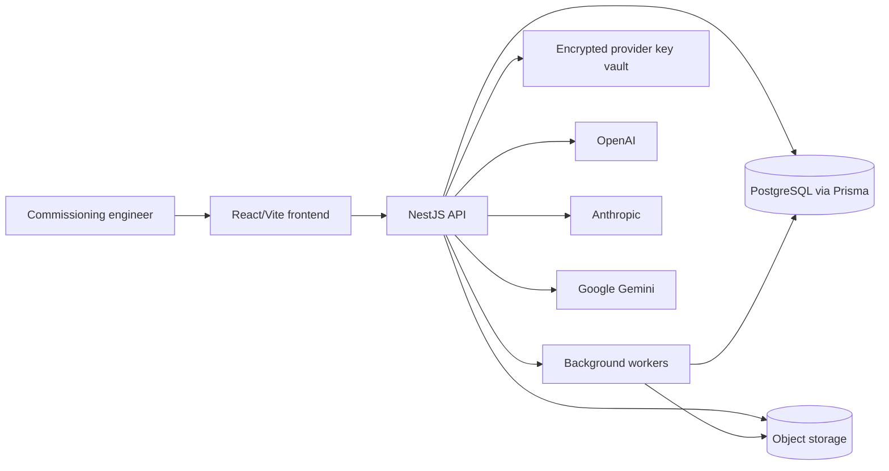
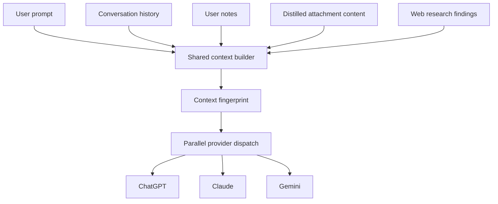
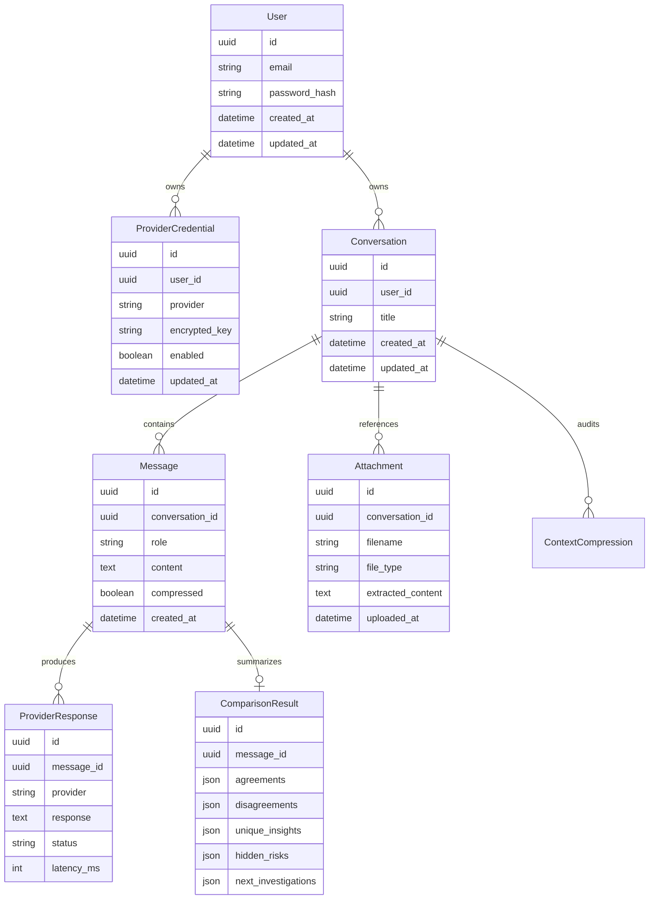

# Architecture Blueprint

## Scope

This blueprint translates `docs/PRD.md` into the target technical architecture for the MVP. The architecture is optimized for identical shared context, parallel provider execution, failure isolation, and resumable commissioning investigations.

## System Context

## Frontend Architecture

Responsibilities:

- Authenticate users and protect app routes.
- Manage conversation list, resume, rename, and delete flows.
- Present a responsive tri-column model workspace for ChatGPT, Claude, and Gemini.
- Stream each provider response independently without blocking other columns.
- Render structured comparison modes: raw, structured, consensus, and conflict.
- Upload attachments and show extraction/reuse status.
- Manage provider credentials and enabled/disabled states.

Key decisions:

- React + Vite + TypeScript is the app shell.
- Tailwind CSS and shadcn-style primitives provide fast, consistent UI composition.
- TanStack Query owns server state once APIs are introduced.
- Streaming transport will be wrapped behind a frontend client so SSE/WebSocket can be swapped after Milestone 4 design validation.

## Backend Architecture

Responsibilities:

- Authenticate requests and scope data to the current user.
- Persist conversations, messages, provider responses, comparisons, attachments, and compressed context.
- Construct a single shared context envelope for every model turn.
- Dispatch enabled providers in parallel and isolate provider failures.
- Stream partial provider output to the frontend.
- Generate structured comparisons after available provider responses complete.
- Run attachment extraction and context compression workers.
- Encrypt provider credentials at rest and redact secrets from logs.

Planned NestJS modules:

- `auth`: registration, login, refresh, logout, guards, and user context.
- `users`: profile and account ownership boundaries.
- `conversations`: conversation CRUD, message submission, search, and resume.
- `providers`: credential management, provider health, quotas, and orchestration adapters.
- `comparison`: agreement, disagreement, unique insight, hidden risk, and next-investigation artifacts.
- `attachments`: upload validation, extraction status, and context references.
- `compression`: long-session memory compression and audit logs.
- `health`: app and dependency checks for CI and operations.

## Shared Context Contract

Every provider call must receive the same normalized context envelope:

Context rules:

- The backend creates the shared context once per user turn.
- The context is fingerprinted and recorded before dispatch.
- No provider-specific privileged context is allowed.
- Attachment references, equipment identifiers, assumptions, findings, and decisions must survive compression.
- Provider failures preserve successful responses and comparison still runs with available outputs.

## Data Architecture

## Delivery Architecture

- Root npm workspaces coordinate `frontend`, `backend`, and `shared` packages.
- CI installs with `npm ci`, generates the Prisma client, applies migrations to a Postgres service, then runs lint, typecheck, tests, and build across workspaces.
- Local development runs both app surfaces with `npm run dev` or `./dev.sh`.
- Docker Compose provides local PostgreSQL; Prisma migrations, seed data, and database-backed health checks own the foundational data layer.

## Open Decisions

- Streaming transport: default to SSE unless WebSocket requirements emerge during Milestone 4.
- Background jobs: choose BullMQ/Redis or an equivalent worker queue during Milestone 7 planning.
- Secret storage: start with application-level encryption for local/dev, then evaluate KMS/secrets manager for hosted environments in Milestone 8.
- Object storage: choose S3-compatible storage before attachment implementation.
